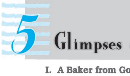
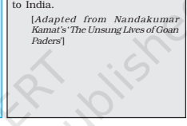
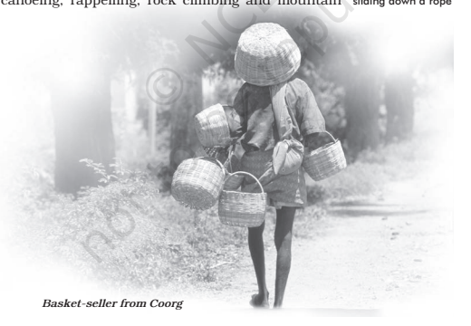

## Activity

Discuss in class

I

A Baker from Goa
This is a pen-portrait of a traditional Goan village baker who still has an important place in his society.

OUR **elders are often heard reminiscing nostalgically** about those good old Portuguese days, the Portuguese and their famous loaves of bread. Those eaters of loaves might have vanished but the makers are still there. We still have amongst us the mixers, the moulders and those who bake the loaves. Those age-old, timetested furnaces still exist. The fire in the furnaces has not yet been extinguished. The thud and jingle of reminiscing

 nostalgically thinking fondly of the past 1. **What images - of people and of places - come to your mind,**
when you think of our country?

2. **What parts of India have you lived in, or visited? Can you name**
some popular tourist destinations?

3. **You may know that apart from the British, the Dutch and the**
French, the Portuguese have also played a part in the history of our country. Can you say which parts of India show French and Portuguese influences?

4. **Can you say which parts of India grow (i) tea, (ii) coffee?**

heralding announcing First Flight the traditional baker's bamboo, heralding **his arrival** in the morning, can still be heard in some places.

Maybe the father is not alive but the son still carries on the family profession. These bakers are, even today, known as pader **in Goa.**
During our childhood in Goa, the baker used to be our friend, companion and guide. He used to come at least twice a day. Once, when he set out in the morning on his selling round, and then again, when he returned after emptying his huge basket. The jingling thud of his bamboo woke us up from sleep and we ran to meet and greet him. Why was it so? Was it for the love of the loaf? Not at all. The loaves were bought by some Paskine or Bastine, the maid-servant of the house! What we longed for were those bread-bangles which we chose carefully. Sometimes it was sweet bread of special make.

The baker made his musical entry on the scene with the 'jhang, jhang' sound of his specially made bamboo staff. One hand supported the basket on his head and the other banged the bamboo on the ground. He would greet the lady of the house with "Good morning" and then place his basket on the vertical bamboo. We kids would be pushed aside with a mild rebuke and the loaves would be delivered to the servant. But we would not give up. We would climb a bench or the parapet and peep into the basket, somehow. I can still recall the typical fragrance **of those loaves. Loaves for the elders and** the bangles for the children. Then we did not even care to brush our teeth or wash our mouths properly. And why should we? Who would take the trouble of plucking the mango-leaf for the toothbrush? And why was it necessary at all? The tiger never brushed his teeth. Hot tea could wash and clean up everything so nicely, **after all!**
rebuke

 an expression of disapproval; a scolding fragrance scent Oral Comprehension Check

 1. **What are the elders in Goa nostalgic about?** 2. **Is bread-making still popular in Goa? How do you know?** 3. **What is the baker called?** 4. **When would the baker come everyday? Why did the children**
run to meet him?

Marriage gifts are meaningless without the sweet bread known as the bol**, just as a party or a feast**
loses its charm without bread. Not enough can be said to show how important a baker can be for a village. The lady of the house must prepare sandwiches on the occasion of her daughter's engagement. Cakes and bolinhas **are a must for**
Christmas as well as other festivals. Thus, the presence of the baker's furnace in the village is absolutely essential.

The baker or bread-seller of those days had a peculiar dress known as the kabai**. It was a singlepiece long frock reaching down to the knees. In our**
childhood we saw bakers wearing a shirt and trousers which were shorter than full-length ones and longer than half pants. Even today, anyone who wears a half pant which reaches just below the knees invites the comment that he is dressed like a **pader**!

The baker usually collected his bills at the end of the month. Monthly accounts used to be recorded on some wall in pencil. Baking was indeed a profitable profession in the old days. The baker and his family never starved. He, his family and his servants always looked happy and prosperous. Their plump physique was an open testimony to this. Even today any person with a jackfruit-like physical appearance is easily compared to a baker.

 open testimony public statement about a character or quality Oral Comprehension Check

Glimpses of India

## 1. **Match The Following. What Is A Must**

(i) as marriage gifts? - **cakes and** bolinhas
(ii) for a party or a feast? - **sweet bread called** bol
(iii) for a daughter's engagement? - **bread**
(iv) for Christmas? - **sandwiches**
2. **What did the bakers wear: (i) in the Portuguese days? (ii) when the**
author was young?

3. **Who invites the comment - "he is dressed like a pader"? Why?** 4. **Where were the monthly accounts of the baker recorded?** 5. **What does a 'jackfruit-like appearance' mean?**

## 1. **Which Of These Statements Are Correct?**

(i) **The pader was an important person in the village in old times.**
(ii) Paders **still exist in Goan villages.**
(iii) The paders **went away with the Portuguese.**
(iv) The paders **continue to wear a single-piece long frock.**
(v) **Bread and cakes were an integral part of Goan life in the old days.**
(vi) **Traditional bread-baking is still a very profitable business.**
(vii) Paders **and their families starve in the present times.**
2. **Is bread an important part of Goan life? How do you know this?** 3. **Tick the right answer. What is the tone of the author when he says the following?**
(i) **The thud and the jingle of the traditional baker's bamboo can still be**
heard in some places. (nostalgic, hopeful, sad)
(ii) **Maybe the father is not alive but the son still carries on the family**
profession. (nostalgic, hopeful, sad)
(iii) **I still recall the typical fragrance of those loaves. (nostalgic, hopeful,**
naughty)
(iv) **The tiger never brushed his teeth. Hot tea could wash and clean up**
everything so nicely, after all. (naughty, angry, funny)
(v) Cakes and bolinhas **are a must for Christmas as well as other festivals.**
(sad, hopeful, matter-of-fact)
(vi) **The baker and his family never starved. They always looked happy and**
prosperous. (matter-of-fact, hopeful, sad)
I. **In this extract, the author talks about traditional bread-baking during his**
childhood days. Complete the following table with the help of the clues on the left. Then write a paragraph about the author's childhood days.

| Clues                                                                                                                 | Author's childhood days   |
|-----------------------------------------------------------------------------------------------------------------------|---------------------------|
| the way bread was baked the way the pader sold bread what the pader wore when the pader was paid how the pader looked |                           |

First Flight II. 1. **Compare the piece from the text (on the left below) with the other piece**
on Goan bakers (on the right). What makes the two texts so different?

Are the facts the same? Do both writers give you a picture of the baker?

Our elders are often heard reminiscing nostalgically about those good old Portuguese days, the Portuguese and their famous loaves of bread. Those eaters of loaves might have vanished but the makers are still there. We still have amongst us the mixers, the moulders and those who bake the loaves. Those age-old, time-tested furnaces still exist. The fire in the furnaces had not yet been extinguished. The thud and the jingle of the traditional baker's bamboo, heralding his arrival in the morning, can still be heard in some places.

May be the father is not alive but the son still carries on the family profession.

After Goa's liberation, people used

 to say nostalgically that the Portuguese bread vanished with the paders. But the paders **have** managed to survive because they have perfected the art of door-todoor delivery service. The **paders**
pick up the knowledge of breadmaking from traditions in the family. The leavened, oven-baked bread is a gift of the Portuguese to India.

[**Adapted from Nandakumar** 

2. **Now find a travel brochure about a place you have visited. Look at the**
description in the brochure. Then write your own account, adding details from your own experience, to give the reader a picture of the place, rather than an impersonal, **factual description.**
1. **In groups, collect information on how bakeries bake bread now and how the**
process has changed over time.

2. **There are a number of craft-based professions which are dying out. Pick one**
of the crafts below. Make a group presentation to the class about the skills required, and the possible reasons for the decline of the craft. Can you think of ways to revive these crafts?

(i) Pottery (v) **Carpentry**
(ii) Batik work (vi) **Bamboo weaving**
(iii) Dhurri (rug) weaving (vii) **Making jute products**
(iv) Embroidery (viii) **Handloom**
Glimpses of India 67

# I I Coorg Coorg Is Coffee Country, Famous For Its Rainforests And Spices.

MIDWAY **between Mysore and the coastal town of** Mangalore sits a piece of heaven that must have drifted from **the kingdom of god. This land of rolling** hills is inhabited by a proud race of martial **men,** beautiful women and wild creatures.

Coorg, or Kodagu, the smallest district of Karnataka, is home to evergreen rainforests, spices and coffee plantations. Evergreen rainforests cover thirty per cent of this district. During the monsoons, it pours enough to keep many visitors away. The season of joy commences from September and continues till March. The weather is perfect, with some showers thrown in for good measure. The air breathes of invigorating coffee. Coffee estates and colonial bungalows stand tucked under tree canopies in prime **corners.**
The fiercely independent people of Coorg are possibly of Greek or Arabic descent. As one story goes, a part of Alexander's army moved south along the coast and settled here when return became impractical. These people married amongst the locals and their culture is apparent in the martial traditions, marriage and religious rites, which are distinct from the Hindu mainstream. The theory of Arab origin draws support from the long, black coat mainstream a tradition which Traditional Coorgi dress **most people follow**
drifted from been carried along gently by air martial having to do with war

canopies roof-like coverings that form shelters prime here, **best**
with an embroidered waist-belt worn by the Kodavus.

Known as kuppia, it resembles the kuffia **worn by**
the Arabs and the Kurds.

Coorgi homes have a tradition of hospitality, and they are more than willing to recount numerous tales of valour related to their sons and fathers. The Coorg Regiment is one of the most decorated in the Indian Army, and the first Chief of the Indian Army, General Cariappa, was a Coorgi. Even now, Kodavus are the only people in India permitted to carry firearms without a licence.

The river, Kaveri, obtains its water from the hills and forests of Coorg. Mahaseer - a large freshwater fish - abound in these waters. Kingfishers dive for their catch, while squirrels and langurs drop partially eaten fruit for the mischief of enjoying the splash and the ripple effect in the clear water.

Elephants enjoy being bathed and scrubbed in the river by their mahouts.

The most laidback **individuals become converts**
to the life of high-energy adventure with river rafting, canoeing, rappelling, rock climbing and mountain tales of valour

 stories of courage and bravery, usually in war most decorated having received the maximum number of awards for bravery in war laidback relaxed; not in a hurry rafting travelling in a river in a raft ( a floating platform made by tying planks together) canoeing travelling in a river in a canoe (a large, narrow boat) rappelling going down a cliff by sliding down a rope

Glimpses of India 69 biking. Numerous walking trails **in this region are** a favourite with trekkers.

Birds, bees and butterflies are there to give you company. Macaques, Malabar squirrels, langurs and slender loris keep a watchful eye from the tree canopy. I do, however, prefer to step aside for wild elephants.

The climb to the Brahmagiri hills brings you into a panoramic view of the entire misty landscape of Coorg. A walk across the rope bridge leads to the sixty-four-acre island of Nisargadhama. Running into Buddhist monks from India's largest Tibetan settlement, at nearby Bylakuppe, is a bonus. The monks, in red, ochre and yellow robes, are amongst the many surprises that wait to be discovered by visitors searching for the heart and soul of India, right here in Coorg.

trails paths created by walking panoramic view

 a view of a wide area of land First Flight FACT FILE

## How To Reach

Madikeri, the district headquarters, is the only gateway to Coorg. The misty hills, lush forests and coffee plantations will cast a spell on you. Find a resort, coffee estate or stay in a home for a truly Coorgi experience. By Air: **The nearest airports are Mangalore (135 km) and Bangalore (260** km). There are flights to Mangalore from Mumbai, and to Bangalore from Ahmedabad, Chennai, Delhi, Goa, Hyderabad, Kochi, Kolkata, Mumbai and Pune. By Rail: **The nearest railheads are at Mysore, Mangalore and Hassan.** By Road: **There are two routes to Coorg from Bangalore. Both are almost** the same distance (around 250-260 km). The route via Mysore is the most frequented one. The other route is via Neelamangal, Kunigal, Chanrayanapatna.

1. **Where is Coorg?**

 2. **What is the story about the Kodavu people's descent?** 3. **What are some of the things you now know about**
(i) **the people of Coorg?**
(ii) **the main crop of Coorg?**
(iii) **the sports it offers to tourists?**

(v) **its distance from Bangalore, and how to get there?**
4. **Here are six sentences with some words in italics. Find phrases from the**
text that have the same meaning. (Look in the paragraphs indicated)
(i) During monsoons it rains so heavily that tourists do not visit Coorg**. (para 2)**
(ii) Some people say that **Alexander's army moved south along the coast**
and settled there. (para 3)
(iii) The Coorg people are always ready to tell **stories of their sons' and fathers'**
valour. (para 4)
(iv) Even people who normally lead an easy and slow life get smitten by **the**
high-energy adventure sports of Coorg. (para 6)
(v) The theory of the Arab origin is supported by **the long coat with**
embroidered waist-belt they wear. (para 3)
(vi) Macaques, Malabar squirrels observe you carefully **from the tree canopy.**
(para 7)

## Collocations

Certain words 'go together'. Such 'word friends' are called collocations**. The**
collocation of a word is 'the company it keeps'. For example, look at the paired sentences and phrases below. Which is a common collocation, and which one is odd? Strike out the odd sentence or phrase.

(a) - 'How old are you?' (b) - **a pleasant person**
- 'How young are you?' - **a pleasant pillow**
1. **Here are some nouns from the text.**
culture monks surprise experience weather **tradition**
Work with a partner and discuss which of the nouns can collocate with which of the adjectives given below. The first one has been done for you.

unique terrible unforgettable serious ancient wide **sudden**
(ii) **monks:**
(iii) **surprise:**
(iv) **experience:**
(v) **weather:**
(vi) **tradition:**
Glimpses of India

71 2. **Complete the following phrases from the text. For each phrase, can you**
find at least one other word that would fit into the blank?

(i) tales of (ii) **coastal** 
(iii) a piece of (iv) **evergreen** 
(v) plantations **(vi) bridge**
(vii) **wild** 
You may add your own examples to this list.

## Iii

 Tea From Assam

Pranjol, a youngster from Assam, is Rajvir's classmate at school in Delhi. Pranjol's father is the manager of a tea-garden in Upper Assam and Pranjol has invited Rajvir to visit his home during the summer vacation.

"CHAI-GARAM... garam-chai**," a vendor called out in a**
high-pitched voice.

He came up to their window and asked,"Chai, **sa'ab?"**
"Give us two cups," Pranjol said. They sipped the steaming hot liquid. Almost everyone in their compartment was drinking tea too.

"Do you know that over eighty crore cups of tea are drunk every day throughout the world?" Rajvir said.

"Whew!" exclaimed Pranjol. "Tea really is very popular."
The train pulled out of the station. Pranjol buried his nose in his detective book again. Rajvir too was an ardent fan of detective stories, but at the moment he was keener on looking at the beautiful scenery.

It was green, green everywhere. Rajvir had never seen so much greenery before. Then the soft green paddy fields gave way to tea bushes.

It was a magnificent view. Against the backdrop of densely wooded hills a sea of tea bushes stretched as far as the eye could see. Dwarfing the tiny tea plants were tall sturdy shade-trees and amidst the orderly rows of bushes busily moved doll-like figures.

First Flight

In the distance was an ugly building with smoke billowing out of tall chimneys.

"Hey, a tea garden!" Rajvir cried excitedly.

Pranjol, who had been born and brought up on a plantation, didn't share Rajvir's excitement.

"Oh, this is tea **country now," he said. "Assam has**
the largest concentration of plantations in the world. **You will see enough gardens to last you a lifetime!"**
"I have been reading as much as I could about tea," Rajvir said. "No one really knows who discovered tea but there are many legends."
"What legends?" "Well, there's the one about the Chinese emperor who always boiled water before drinking it. One day a few leaves of the twigs burning under the pot fell into the water giving it a delicious flavour. It is said they were tea leaves."
"Tell me another!" scoffed Pranjol. "We have an Indian legend too. Bodhidharma, an ancient Buddhist ascetic, cut off his eyelids because he felt sleepy during meditations. Ten tea plants grew out of the eyelids. The leaves of these plants when put in hot water and drunk banished sleep.

"Tea was first drunk in China," Rajvir added,
"as far back as 2700 B.C.! In fact words such as tea, 'chai' and 'chini' **are from Chinese. Tea came to**
Europe only in the sixteenth century and was drunk more as medicine than as beverage."
The train clattered into Mariani junction. The boys collected their luggage and pushed their way to the crowded platform.

Pranjol's parents were waiting for them. Soon they were driving towards Dhekiabari, the tea-garden managed by Pranjol's father.

An hour later the car veered sharply off the main road. They crossed a cattle-bridge and entered Dhekiabari Tea Estate.

On both sides of the gravel-road were acre upon acre of tea bushes, all neatly pruned to the same height. Groups of tea-pluckers, with bamboo baskets on their backs, wearing plastic aprons, were plucking the newly sprouted leaves.

Glimpses of India

Pranjol's father slowed down to allow a tractor, pulling a trailer-load of tea leaves, to pass.

"This is the second-flush or sprouting period, isn't it, Mr Barua?" Rajvir asked. "It lasts from May to July and yields the best tea."
"You seem to have done your homework before coming," Pranjol's father said in surprise.

"Yes, Mr Barua," Rajvir admitted. "But I hope to learn much more while I'm here."
I. 1. Look at these words: upkeep, downpour, undergo, dropout, walk-in. **They**
are built up from a verb (keep, pour, go, drop, walk**) and an adverb or a**
particle (**up, down, under, out, in**).

Use these words appropriately in the sentences below. You may consult a dictionary.

(i) **A heavy has been forecast due to low pressure in the**
Bay of Bengal.

(ii) **Rakesh will major surgery tomorrow morning.**
(iii) **My brother is responsible for the of our family property.**
(iv) **The rate for this accountancy course is very high.**
(v) **She went to the Enterprise Company to attend a** 
interview.

2. **Now fill in the blanks in the sentences given below by combining the**
verb given in brackets with one of the words from the box as appropriate.

over by through out up **down**
(i) **The Army attempted unsuccessfully to the Government.**
(throw)
(ii) **Scientists are on the brink of a major in cancer research.**
(break)
(iii) **The State Government plans to build a for Bhubaneswar**
to speed up traffic on the main highway. (pass)
(iv) **Gautama's on life changed when he realised that the world**
is full of sorrow. (look)
(v) **Rakesh seemed unusually after the game. (cast)**
First Flight
(a) Chess is an interesting game. I am very interested **in chess.** (b) Going trekking in the Himalayas We are very excited **about the**
this summer is an exciting idea. **trek.**
(c) Are all your school books this He was bored **as he had no**
boring? **friends there.**
The -ing adjectives show the qualities **that chess, trekking, or these books**
have: they cause **interest, excitement, or boredom in you. The —**ed/—en adjectives show your mental state, or your physical state: how you feel in response to ideas, events or things. 1. **Think of suitable -ing or -ed adjectives to answer the following**
questions. You may also use words from those given above. How would you describe
(i) **a good detective serial on television?** 
(ii) **a debate on your favourite topic 'Homework Should Be Banned'?**
(v) **how you feel when you watch your favourite programme on**
television? 

(vi) **the look on your mother's face as you waited in a queue?**
(vii) **how you feel when tracking a tiger in a tiger reserve forest?**
Glimpses of India

75 2. **Now use the adjectives in the exercise above, as appropriate, to write**
a paragraph about Coorg.

## 1. **Read The Following Passage About Tea.**

India and tea are so intertwined together that life without the brew is unimaginable. Tea entered our life only in the mid-nineteenth century when the British started plantations in Assam and Darjeeling! In the beginning though, Indians shunned the drink as they thought it was a poison that led to umpteen diseases. Ironically, tea colonised Britain where it became a part of their social diary and also led to the establishment of numerous tea houses.

Today, scientific research across the world has attempted to establish the beneficial qualities of tea - a fact the Japanese and the Chinese knew anyway from ancient times, attributing to it numerous medicinal properties.

[Source: **'History: Tea Anytime' by Ranjit Biswas from**
Literary Review, The Hindu**, 1 October 2006]**
Collect information about tea, e.g. its evolution as a drink, its beneficial qualities. You can consult an encyclopedia or visit Internet websites. Then form groups of five and play the following roles: Imagine a meeting of a tea planter, a sales agent, a tea lover (consumer), a physician and a tea-shop owner. Each person in the group has to put forward his/her views about tea. You may use the following words and phrases. - I feel ... - **It is important to know ...** - I would like you to know ... - **I agree with ...** - It is my feeling ... - **I suggest ...** - May I know why you ... - **I am afraid ...** - I disagree with you ... - **I think that tea ...**
First Flight 2. **You are the sales executive of a famous tea company and you have been asked**
to draft an advertisement for the product. Draft the advertisement using the information you collected for the role play. You can draw pictures or add photographs and make your advertisement colourful.

Given a picture of three different regions of India, giving an idea of how varied and charming and beautiful our country is.

WHAT YOU CAN DO
Get your students to arrange an exhibition of photographs of different places in India

 - good sources are travel articles in Sunday newspapers, or in travel magazines, or in brochures available at travel agents. Ask students to bring in two or three pictures each, accompanied by a short, neatly hand-written write-up on the place shown in the pictures. Arrange them on your classroom walls. Let the students study them. They can then discuss, and later vote on the place they would most like to see.

# The Trees

Can there be a forest without trees? Where are the trees in this poem, and where do they go?

The trees inside are moving out into the forest, the forest that was empty all these days where no bird could sit no insect hide no sun bury its feet in shadow the forest that was empty all these nights will be full of trees by morning. All night the roots work to disengage themselves from the cracks in the veranda floor. The leaves strain toward the glass small twigs stiff with exertion long-cramped boughs shuffling under the roof like newly discharged patients half-dazed, moving to the clinic doors. I sit inside, doors open to the veranda writing long letters in which I scarcely mention the departure of the forest from the house. The night is fresh, the whole moon shines in a sky still open the smell of leaves and lichen still reaches like a voice into the rooms.

My head is full of whispers which tomorrow will be silent. Listen. The glass is breaking. The trees are stumbling forward into the night. Winds rush to meet them. The moon is broken like a mirror, its pieces flash now in the crown of the tallest oak.

ADRIENNE RICH

Adrienne Rich was born in Baltimore, Maryland, U.S.A. in 1929. She is the author of nearly twenty volumes of poetry, and has been called a feminist and a radical poet.

to disengage themselves**: to separate themselves** strain**: make efforts to move**
bough: **branch**
shuffling: **moving repeatedly from one position to another**
lichen: crusty patches or bushy growth on tree trunks/bare **ground formed by**
association of fungus and alga.

1. (i) **Find, in the first stanza, three things that cannot happen in a treeless**
forest.

(ii) **What picture do these words create in your mind: "… sun bury its feet**
in shadow…"? What could the poet mean by the sun's 'feet'?

2. (i) **Where are the trees in the poem? What do their roots, their leaves, and**
their twigs do?

(ii) **What does the poet compare their branches to?**
3. (i) **How does the poet describe the moon: (a) at the beginning of the third**

stanza, and (b) at its end? What causes this change?

(ii) **What happens to the house when the trees move out of it?**
(iii) **Why do you think the poet does not mention "the departure of the forest**
from the house" in her letters? (Could it be that we are often silent about important happenings that are so unexpected that they embarrass us? Think about this again when you answer the next set of questions.)
First Flight

4. **Now that you have read the poem in detail, we can begin to ask what the**
poem might mean. Here are two suggestions. Can you think of others?

(i) **Does the poem present a conflict between man and nature? Compare it**
with A Tiger in the Zoo. **Is the poet suggesting that plants and trees,** used for 'interior decoration' in cities while forests are cut down, are 'imprisoned', and need to 'break out'?

(ii) **On the other hand, Adrienne Rich has been known to use trees as a**
metaphor for human beings; this is a recurrent image in her poetry.

What new meanings emerge from the poem if you take its trees to be symbolic of this particular meaning?

5. You may read the poem 'On Killing a Tree' by Gieve Patel (**Beehive - Textbook**
in English for Class IX, **NCERT). Compare and contrast it with the poem you**
have just read.

Can you find the words below that are spelt

 similarly, and sometimes even pronounced similarly, but have very different meanings? Check their pronunciation and meaning in a dictionary. - **The dump was so full that it had to refuse more**
refuse.

- **When shot at, the dove dove into the bushes.** - **The insurance was invalid for the invalid.**
The Trees

79

